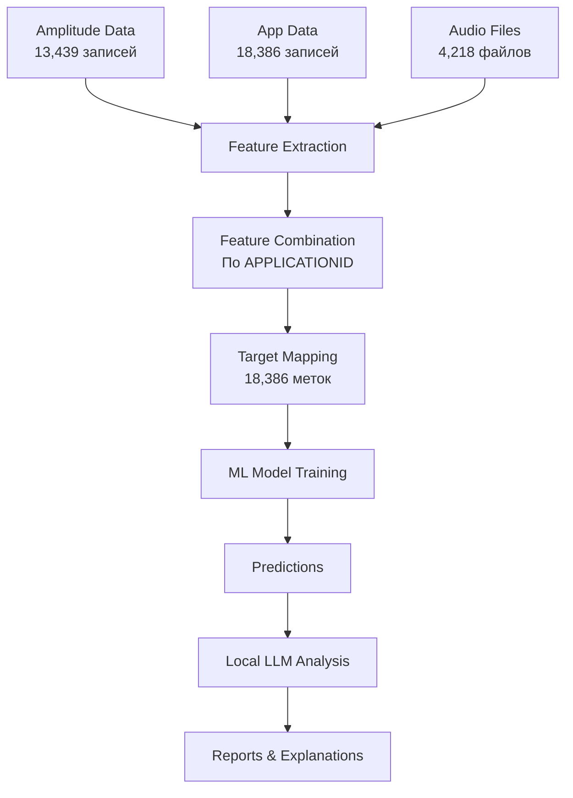

# 🛡️ MVP Антифрод система для банка

> **Статус проекта**: 🔧 В разработке - исправление критических проблем с данными

Система машинного обучения для детекции банковского мошенничества с локальной LLM на основе реальных данных банка.

## 📋 Описание проекта

Антифрод система анализирует реальные банковские данные (Parquet файлы, аудиозаписи звонков) для выявления мошеннических заявок на кредит. Система использует машинное обучение и локальную LLM для классификации и генерации объяснений решений.

**Ключевые особенности:**
- 🔒 **Локальная LLM** через Ollama - полная приватность данных
- 📊 **Реальные банковские данные** - обработка Parquet файлов + аудиозаписи
- 🎯 **Целевые метки** - 18,386 заявок (1.85% мошенничества)
- 💰 **Бесплатно** - без затрат на внешние API
- 🤖 **Объяснимый ИИ** - понятные причины каждого решения

## 🏗️ Архитектура системы

```
hackathon/
├── 📁 data/                           # Реальные банковские данные
│   ├── 📁 amplitude/                  # Parquet файлы с техническими данными
│   │   ├── train_amplitude_chunk_*.parquet  # Чанки данных звонков (13,439 записей)
│   │   ├── train_app_data.parquet           # Данные заявок (18,386 записей)
│   │   ├── train_target_data.parquet        # Целевые метки (18,386 меток)
│   │   └── svod.csv                         # Сводная таблица связей
│   └── 📁 audiofiles/                 # Аудиозаписи звонков (4,218 файлов)
│       └── *.wav                      # Формат: YYYYMMDDHHMMSS_Name_Phone.wav
├── 📁 src/                            # Исходный код системы
│   ├── __init__.py
│   ├── 🎵 audio_processor.py          # Обработка аудиофайлов (MFCC, спектр)
│   ├── 🤖 local_llm_enhancer.py       # Локальная LLM через Ollama
│   ├── 📈 model_trainer.py            # Обучение ML моделей
│   ├── 📊 real_data_loader.py         # Загрузка реальных данных
│   └── 🔧 real_features_processor.py  # Извлечение признаков
├── 📁 scripts/                        # Скрипты запуска
│   ├── train_real_data.py             # Обучение на реальных данных
│   └── predict_real_data_with_llm.py  # Предсказания с LLM объяснениями
├── 📁 models/                         # Сохраненные модели
├── 📁 output/                         # Результаты анализа
└── 📄 requirements.txt                # Python зависимости
```

## 🔄 Пайплайн обработки данных



## 🚨 Текущие проблемы и статус

### ❌ Критическая проблема: Нет пересечения данных
```
🔍 Данные загружены:
  - Amplitude признаки: 13,439 записей
  - App данные: 18,386 записей  
  - Целевые метки: 18,386 меток
  - Audio файлы: 4,218 файлов

❌ Проблема: После объединения по APPLICATIONID → 0 записей
```

**Причины:**
1. **Escape символы**: `Д\286\011639474` могут некорректно обрабатываться
2. **Разные регистры**: `applicationid` vs `APPLICATIONID`
3. **Несовпадение ключей**: разные наборы ID в разных источниках
4. **Кодировка**: проблемы с unicode/latin1 декодированием

### 🔧 Исправления в работе:
- [x] Добавлена отладочная информация для диагностики
- [x] Реализована нормализация ключей (escape символы)  
- [x] Исправлена директория аудиофайлов (`audio` → `audiofiles`)
- [ ] Полное исправление объединения данных
- [ ] Валидация качества признаков

## 📊 Анализ данных

### Структура реальных данных:

#### 🎯 Target Data (Целевые метки)
```python
# Пример записей
APPLICATIONID          target  Доля
Д\286\011639474         0      98.15% (не мошенники)
Д\286\011668478         0      
Д\286\011681466         1      1.85% (мошенники)

# Статистика
Всего меток: 18,386
Не мошенники (0): 18,046 (98.15%)
Мошенники (1): 340 (1.85%)
```

#### 📱 App Data (Данные заявок)
```python
# Ключевые поля
APPLICATIONID, CREATE_DATE, TOTALAMOUNT, CREDITTERM_RBL0
CLI_AGE, GENDER, MARITALSTATUS, PRODUCT_GROUP

# Пример
Д\286\011639474, 2024-10-17, 150000, 12, 36, Мужской, Женат/Замужем
```

#### 📈 Amplitude Data (Технические данные)
```python
# Поля событий приложения
applicationid, event_time, event_type, session_id
device_brand, os_name, ip_address, user_id

# События: cash_loan_uploading, session_start, main_page
```

#### 🎵 Audio Files (4,218 файлов)
```
Формат имени: YYYYMMDDHHMMSS_Name_Phone_Codes.wav
Пример: 20241108150819_Sadvakasova_Altynay_77077011421,_500213,_500214.wav

Связь через svod.csv:
APPLICATIONID → Файлы → Аудио признаки
```

## 🔧 Компоненты системы

### 📊 RealDataLoader
- **Назначение**: Загрузка всех типов реальных данных
- **Форматы**: Parquet, CSV, WAV
- **Функции**:
  - `load_amplitude_chunks()` - техданные по чанкам
  - `load_app_data()` - справочники заявок  
  - `load_target_data()` - целевые метки мошенничества
  - `get_audio_files_metadata()` - связка аудио→ID

### 🔧 RealFeaturesProcessor  
- **Назначение**: Извлечение признаков из всех источников
- **Типы признаков**:
  - **Amplitude**: статистики событий приложения (116 признаков)
  - **App**: профиль клиента и заявки (64 признака)
  - **Audio**: MFCC, спектральные, временные
  - **Temporal**: временные паттерны активности
- **Проблема**: Объединение по APPLICATIONID не работает

### 🎵 AudioProcessor
- **MFCC**: 13 коэффициентов (мел-частотные кепстральные)
- **Спектральные**: центроид, полоса, roll-off, ZCR
- **Временные**: RMS энергия, тишина, основная частота
- **Формат**: WAV 22050Hz

### 📈 ModelTrainer
- **Алгоритм**: Random Forest (100 деревьев, глубина 10)
- **Балансировка**: Учет дисбаланса классов (1.85% мошенничества)
- **Метрики**: AUC-ROC, Precision, Recall, F1-Score
- **Проблема**: Не может обучиться без данных

### 🤖 LocalLLMEnhancer
- **LLM**: Ollama (llama3.2:3b локально)
- **Функции**: 
  - Объяснение решений на русском языке
  - Анализ ключевых факторов риска
  - Генерация рекомендаций
  - Создание HTML отчетов
- **Преимущества**: Полная приватность, без API

## 🚀 Установка и запуск

### 1. Установка Ollama (локальная LLM)

```bash
# macOS/Linux
curl -fsSL https://ollama.ai/install.sh | sh

# Windows
# Скачать с https://ollama.ai/download

# Запуск сервера
ollama serve

# Загрузка модели (в новом терминале)
ollama pull llama3.2:3b
```

### 2. Установка Python зависимостей

```bash
# Клонирование и установка
git clone <repository>
cd hackathon
pip install -r requirements.txt
```

### 3. Подготовка данных

Убедитесь что данные размещены правильно:
```bash
hackathon/data/
├── amplitude/
│   ├── train_amplitude_chunk_*.parquet  # ✅ Ваши чанки
│   ├── train_app_data.parquet           # ✅ Данные заявок  
│   ├── train_target_data.parquet        # ✅ Целевые метки
│   └── svod.csv                         # ✅ Связки
└── audiofiles/                          # ✅ Переименовано из 'audio'
    └── *.wav                            # ✅ 4,218 файлов
```

### 4. Запуск системы

#### Обучение (с исправлением проблем):
```bash
python scripts/train_real_data.py
```

#### Предсказания с LLM:
```bash
python scripts/predict_real_data_with_llm.py
```

## 📋 Зависимости

### Основные библиотеки:
```python
# Обработка данных
pandas>=1.5.0           # DataFrame операции
numpy>=1.21.0           # Численные вычисления  
pyarrow>=10.0.0         # Parquet файлы

# Машинное обучение
scikit-learn>=1.2.0     # ML алгоритмы

# Аудио обработка  
librosa>=0.9.0          # Аудио анализ
soundfile>=0.12.0       # Чтение WAV

# Локальная LLM
requests>=2.28.0        # Ollama API
psutil>=5.9.0           # Мониторинг ресурсов

# Утилиты
tqdm>=4.64.0            # Progress bars
joblib>=1.2.0           # Сериализация моделей
matplotlib>=3.6.0       # Визуализация
seaborn>=0.12.0         # Статистические графики
```

## 🎯 Ожидаемые результаты

### После исправления проблем:

#### В директории `models/`:
- `antifraud_model_v1.joblib` - обученная модель Random Forest
- `model_info.txt` - метрики качества и статистики
- `feature_importance.csv` - важность признаков

#### В директории `output/`:
- `real_data_predictions_with_llm.csv` - детальные предсказания с объяснениями LLM
- `real_data_fraud_report.txt` - текстовый аналитический отчет  
- `real_data_fraud_analysis.html` - интерактивный веб-отчет
- `training_report.txt` - отчет об обучении модели

#### Пример результатов:
```
APPLICATIONID: Д\286\011639474
Вероятность мошенничества: 85%
Риск: ВЫСОКИЙ
Объяснение LLM: Подозрительная активность в приложении - необычные временные паттерны событий, 
аномальная последовательность действий при подаче заявки...
Ключевые факторы: session_duration_max, event_frequency_evening, audio_mfcc_variance
Рекомендации: Немедленная проверка документов, дополнительная верификация личности
```

## 📈 Ожидаемые метрики качества

### Цели по метрикам (после исправления):
- **AUC-ROC**: > 0.85 (хорошая разделимость классов)
- **Precision**: > 0.60 (из предсказанных мошенников 60%+ реальные)  
- **Recall**: > 0.40 (поймать 40%+ всех мошенников)
- **F1-Score**: > 0.48 (баланс точности и полноты)

### Учет дисбаланса классов:
```python
# Распределение
Не мошенники: 18,046 (98.15%)
Мошенники: 340 (1.85%)

# Стратегии
- Балансировка весов в Random Forest
- Настройка порога классификации  
- Метрики, устойчивые к дисбалансу
```

## 🔧 Диагностика и отладка

### Проверка системы:
```bash
# Проверка структуры данных
python -c "
from src.real_data_loader import RealDataLoader
loader = RealDataLoader('data')
print('Amplitude chunks:', len(loader.load_amplitude_chunks()))
print('App data:', len(loader.load_app_data()))  
print('Target data:', len(loader.load_target_data()))
print('Audio files:', len(loader.get_audio_files_metadata()))
"

# Проверка Ollama
ollama list
curl http://localhost:11434/api/generate -d '{"model":"llama3.2:3b","prompt":"test"}'
```

### Отладочная информация:
```python
# В логах будет показано:
🔍 Целевая колонка: target
🔍 Колонка для слияния: APPLICATIONID  
🔍 Пересечение ключей: X из Y features и Z target
🔍 Примеры ключей features: ['Д\286\011221568', ...]
🔍 Примеры ключей target: ['Д\286\011639474', ...]
```

## 🚨 Решение текущих проблем

### План исправления:

1. **✅ Диагностика** - добавлена отладочная информация
2. **✅ Нормализация ключей** - обработка escape символов
3. **🔧 В процессе: Валидация объединения** - проверка результатов merge
4. **📋 Планируется: Fallback стратегии** - альтернативные способы связывания данных

### Fallback подходы:
- Связывание по частичному совпадению ID
- Использование временных меток для связи
- Анализ только доступных данных без полного объединения

## ⚡ Производительность

### Системные требования:
- **RAM**: 8GB+ (для данных + LLM)
- **CPU**: 4+ ядра для параллельной обработки  
- **Диск**: 15GB (данные + модели + Ollama)
- **GPU**: Опционально (ускорение LLM)

### Время выполнения:
- **Загрузка данных**: 2-5 минут (зависит от размера Parquet)
- **Извлечение признаков**: 10-20 минут (аудио обработка)
- **Обучение модели**: 5-10 минут (после исправления данных)
- **Генерация отчетов с LLM**: 15-30 минут

## 🔮 Планы развития

### Краткосрочные (после исправления основных проблем):
- [ ] Исправление объединения данных по APPLICATIONID
- [ ] Валидация качества извлеченных признаков
- [ ] Настройка гиперпараметров модели
- [ ] Улучшение HTML отчетов

### Среднесрочные:
- [ ] Добавление новых типов признаков (NLP для текстовых полей)
- [ ] Ансамбль моделей (RF + XGBoost + Neural Network)  
- [ ] Real-time обработка новых заявок
- [ ] Web интерфейс для аналитиков

### Долгосрочные:
- [ ] API для интеграции с банковскими системами
- [ ] Автоматическое переобучение на новых данных
- [ ] Продвинутая объяснимость (SHAP + детальный LLM анализ)
- [ ] Мультимодальные модели (текст + аудио + поведение)

## 👥 Команда и поддержка

**MVP команда хакатона** - разработка антифрод решения для банковской сферы

**Текущий фокус**: Исправление критических проблем с обработкой данных

## 📄 Лицензия

MIT License - свободное использование для образовательных и коммерческих целей.

---

## 🔥 Статус: Система готова к исправлению!

### Следующие шаги:
1. **Запустить диагностику**: `python scripts/train_real_data.py`
2. **Анализировать логи**: найти причину пустого объединения данных
3. **Исправить маппинг**: обеспечить корректное связывание по APPLICATIONID  
4. **Валидировать результат**: убедиться что признаки извлекаются корректно
5. **Обучить модель**: получить рабочую антифрод систему

### 🎯 Ожидаемый результат:
- ✅ 18,386 заявок с признаками и метками
- ✅ Обученная модель с метриками качества  
- ✅ LLM объяснения для каждого решения
- ✅ Готовые отчеты для банковских аналитиков

**Система готова стать полнофункциональным MVP антифрод решением!** 🚀